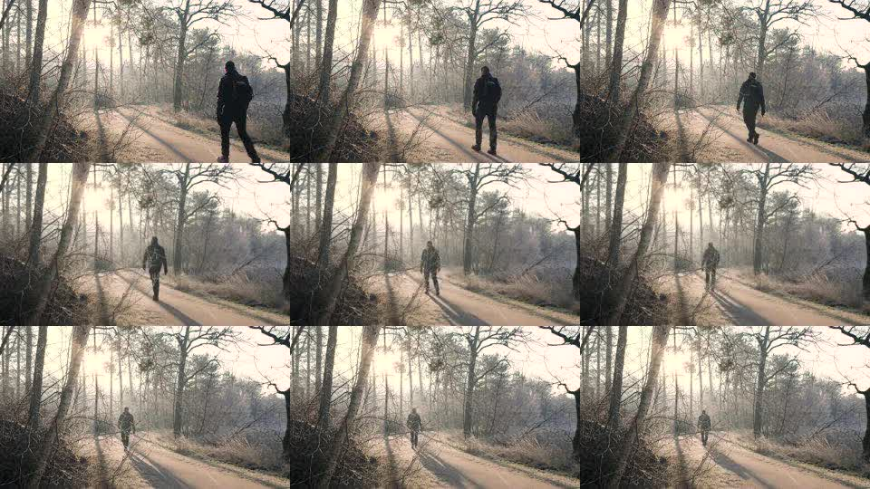

## About

videotosprite is a simple script to create sprite image from a video file
<p>
    <video src="./sample_video.mp4" controls></video>
</p>
<p>
    </img>
</p>

## Dependencies

- [php](https://www.php.net/downloads.php)
- [ffmpeg](https://ffmpeg.org)

## Installation
- clone project
```
git clone https://github.com/LeoDesu/videotosprite
```

### Optional
<p>add execute permission and move file to system path for global access</p>

- Linux

```
sudo chmod +x videotosprite.php
sudo mv videotosprite.php /usr/local/bin/videotosprite
```

## Usage
### basic use with no options will create 10x10 sprite image

```
php videotosprite.php [video_input]
```
or with custom output
```
php videotosprite.php [video_input] [output_name]
```
<p>output_name can have a custom image file extension or just a name without extension, then default .jpg extension will be used</p>

### use --size option to provide custom size
```
php videotosprite.php --size 4x4 [video_input] [output_name]
```
<p>parameter for --size are numbers of WIDTHxHEIGHT with x as separater and no white space</p>

## Credits
- [Video Sample: hiking walking trail man alone 282995](https://pixabay.com/videos/hiking-walking-trail-man-alone-282995/)


## License
[MIT license](https://opensource.org/licenses/MIT).